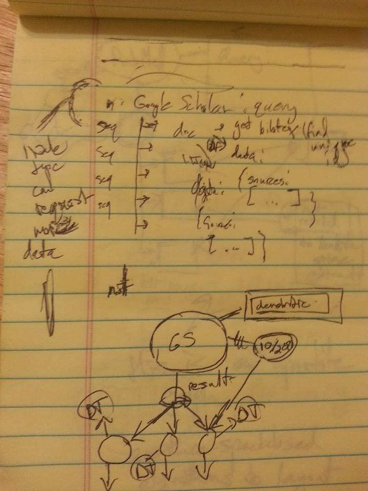
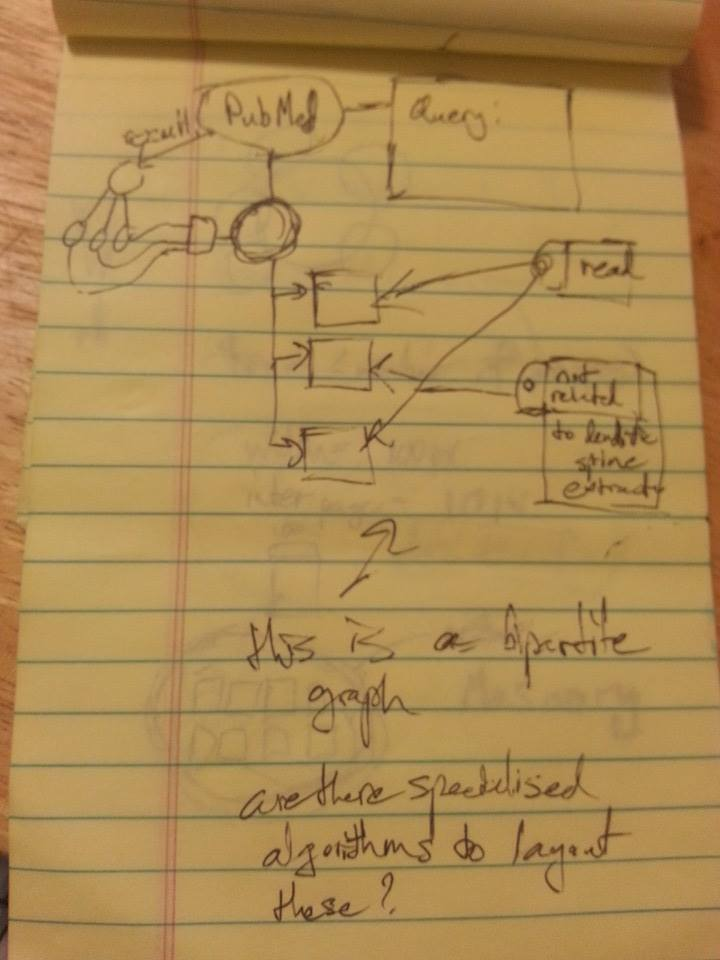
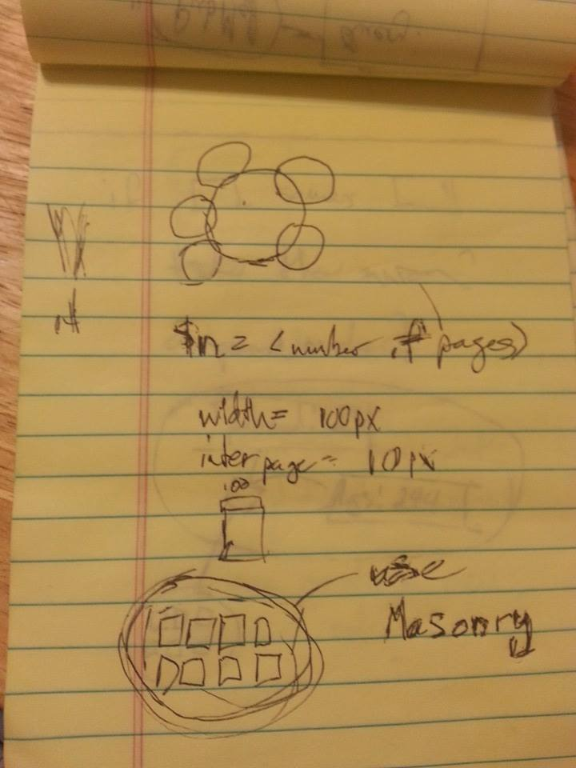
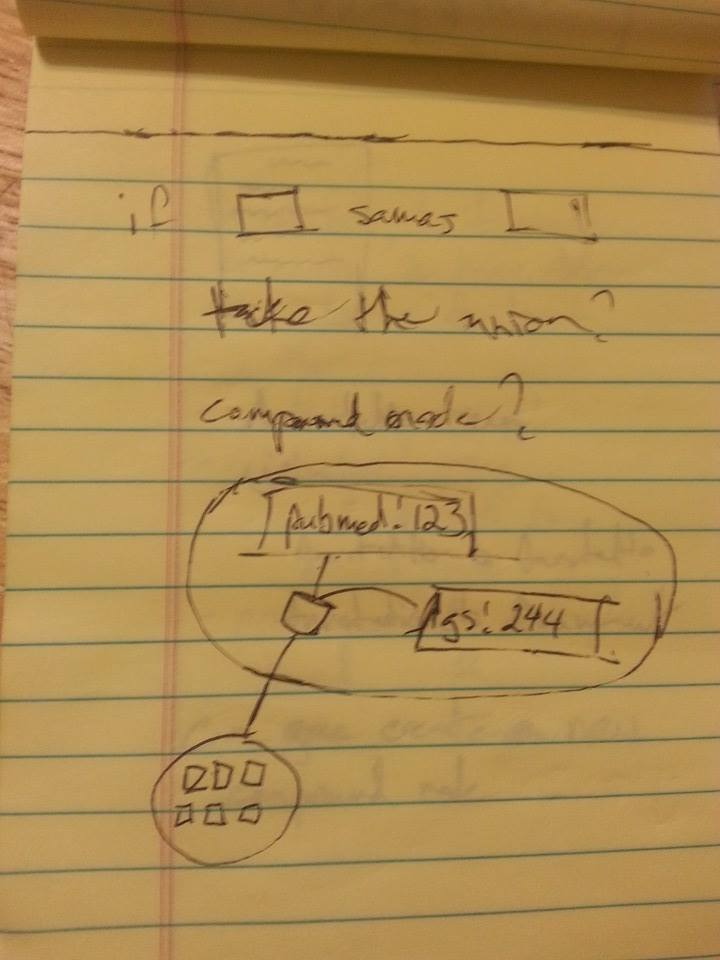
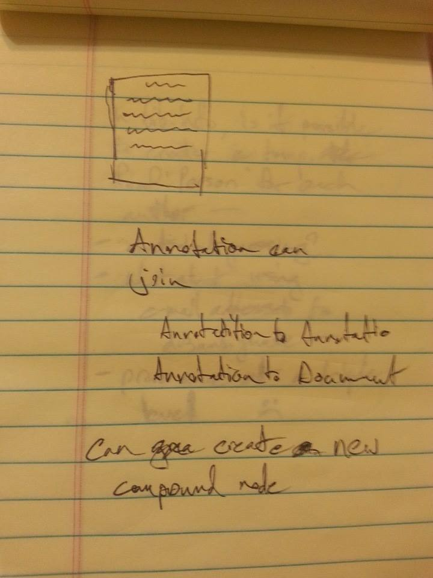
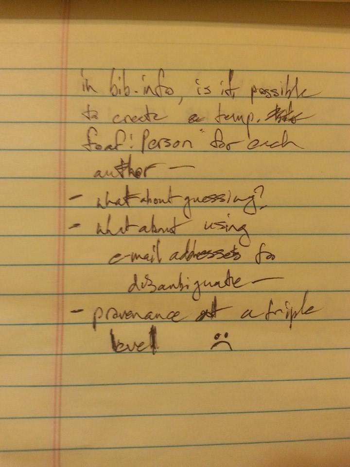
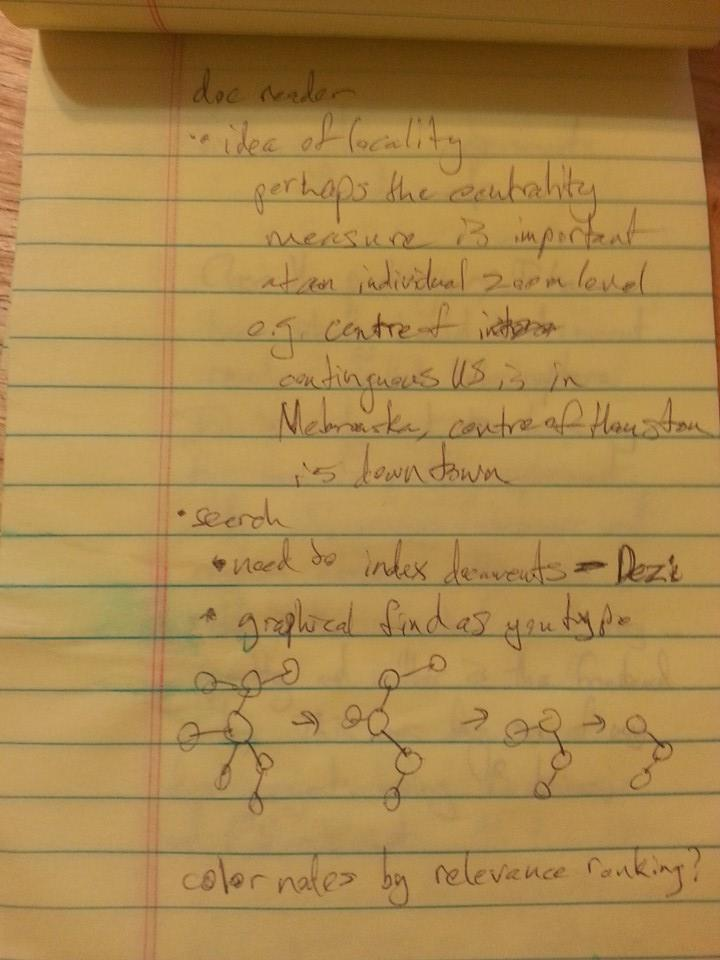
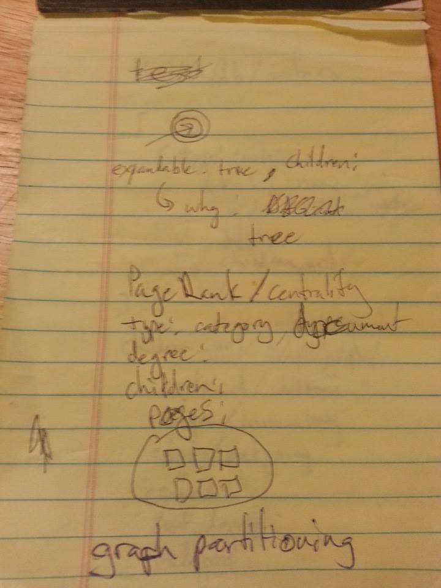

A possible search query interface based on a graph

Tagging visualisation. Tagging creates a bipartite graph.

Documents that refer to the same underlying content but with different identifiers.

How annotations should interact with the graph as a whole.

Extracting document authors.

A way to get a quick overview of all the pages in a document.

More thinking about how graphs can exploit locality for UI.

Also a way to filter graphs interactively for search.

Thinking about graphs

